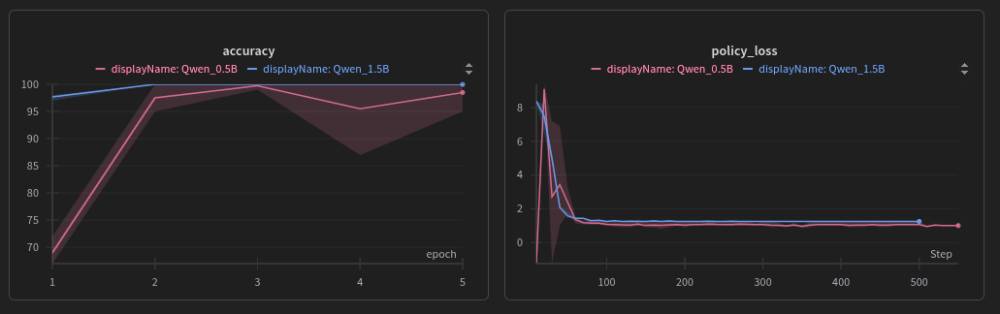

# Simple Agent + Tool + RL Example

This repository explores the use of tools and reinforcement learning in an agent to solve math problems.
Its main purpose is to understand how to train an SLM to use tools with RL.

Therefore, we created a synthetic [dataset](https://huggingface.co/datasets/Sebasdi/art_math_test) of textual math questions and compared how the instruction models perform without any option to use a calculator tool. The **Baseline** table shows the results. The 3B model can solve almost all math problems, while the 1.5B and 0.5B models struggle. 

In the **Tool** table, we provide the performance of the untrained model given access to a calculator tool. The 3B model can follow the instructions to use a tool well and slightly improves its overall performance compared to the baseline. However, the 1.5B and 0.5B models fail to utilize the tool reliably, and as such, they drop even further in performance. 

In the table **Tool + RL**, you can see the performance of all models after being trained to solve the math task with the calculator tool available. All models solve the questions almost always with 100%.


## Setup

```bash
conda env create -f environment.yml
conda activate art
```

## Scripts

- **simple_eval.py:** Simple evaluation script to test baseline agent  without tools.
- **simple_eval_tool.py:** Simple evaluation script to test agent with tools.
- **simple_train.py:** Simple training script to train agent with tools.


# Eval results 

## Baseline

| Model                          | Dataset | Accuracy (3 seeds)| Tools |
| :----------------------------- | :------ | :------- | :---- |
| Qwen2.5-3B-Instruct-bnb-4bit | math    |  90%, 94%, 91%      | none  |
| Qwen2.5-1.5B-Instruct-unsloth-bnb-4bit | math    |  46%, 60%, 58%       | none  |
| Qwen2.5-0.5B-Instruct-bnb-4bit | math    |  12%, 12%, 15%      | none  |


## Tool

| Model                          | Dataset | Accuracy (3 seeds)| Tools |
| :----------------------------- | :------ | :------- | :---- |
| Qwen2.5-3B-Instruct-bnb-4bit | math    |  97%, 91%, 94%      | yes |
| Qwen2.5-1.5B-Instruct-unsloth-bnb-4bit | math    |  38%, 41%, 41%      | yes |
| Qwen2.5-0.5B-Instruct-bnb-4bit | math    |  4%, 12%, 12%      | yes |

## Tool + RL

| Model                          | Dataset | Accuracy (3 seeds)| Tools |
| :----------------------------- | :------ | :------- | :---- |
| Qwen2.5-3B-Instruct-bnb-4bit | math    |  100%, 100%, 100%      | yes |
| Qwen2.5-1.5B-Instruct-unsloth-bnb-4bit | math    |  100%, 100%, 100%      | yes |
| Qwen2.5-0.5B-Instruct-bnb-4bit | math    |  100%, 100%, 95%      | yes |

Training curves of the 0.5B and 1.5B models. 3B model solves all tasks within the first epoch.

